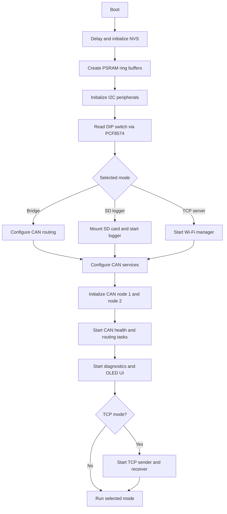
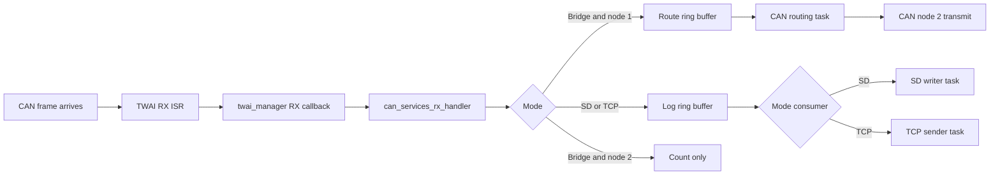
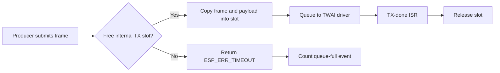

# CAN FD Analyzer Architecture

## Purpose

This firmware runs on an ESP32-C5 and provides three CAN/CAN FD operating modes selected at boot with a DIP switch:

- CAN bridge: forwards frames received on CAN bus 1 to CAN bus 2.
- SD logger: records received frames to a timestamped binary file on an SD card.
- TCP server: streams received frames to a TCP client and accepts TCP CAN-frame commands for transmission.

The application supports two independently configured TWAI/CAN FD nodes. Board-specific pins, rates, ports, and memory sizes are defined in `main/app_config.h`.

## Startup Flow

`app_main()` is the composition root. It performs configuration and starts components; it does not contain task implementations.



## Operating Modes

### CAN Bridge Mode

CAN bus 1 is the source and CAN bus 2 is the destination. Frames received by node 1 are placed in the route ring buffer. The CAN routing task takes each frame from that buffer and submits it to node 2.

Frames received by node 2 are counted but are not routed back to node 1. This avoids a forwarding loop.

### SD Logger Mode

All received CAN frames are placed in the log ring buffer. `can_logger` drains that buffer, batches data into 16 KiB blocks, and appends binary records to a timestamped file on the mounted SD card.

The eject button requests a clean stop. The logger writes pending data, synchronizes the filesystem, unmounts the SD card, and the OLED displays that removal is safe.

### TCP Server Mode

All received CAN frames are placed in the log ring buffer. `tcp_service` waits for Wi-Fi, then starts two TCP listeners:

- TCP transmit listener on port 3333: streams batches of `log_frame_t` CAN records to one client.
- TCP receive listener on port 3334: receives complete CAN command records and transmits them on CAN node 1 or node 2 according to `node_id`.

TCP is a stream protocol, so the receiver accumulates partial reads until it has one complete command record. The sender uses a send-all loop so a short socket write cannot truncate a record batch.

## Sending a CAN Frame from a PC

Set the DIP switch to TCP server mode, wait for Wi-Fi to connect, and obtain the ESP32 IP address from the OLED or serial output. Open a TCP connection to port `3334` and send one or more packed CAN command records.

Each record is exactly 74 bytes and uses little-endian byte order:

| Offset | Field | Type | Description |
| --- | --- | --- | --- |
| 0 | `timestamp` | `uint32_t` | Currently ignored on transmit. Send `0`. |
| 4 | `node_id` | `uint8_t` | `0` or `1` sends through CAN node 1. Any other value sends through CAN node 2. |
| 5 | `id` | `uint32_t` | CAN identifier. Set bit 31 for an extended 29-bit identifier. |
| 9 | `dlc` | `uint8_t` | CAN DLC from `0` to `15`. The firmware bounds larger values to `15`. |
| 10 | `data` | `uint8_t[64]` | Payload bytes, padded with zeroes to 64 bytes. |

CAN FD DLC values map to payload lengths as follows: `0..8` map directly, then `9=12`, `10=16`, `11=20`, `12=24`, `13=32`, `14=48`, and `15=64` bytes. Only the bytes defined by the DLC are placed on the CAN bus.

Example: send a standard CAN FD frame with ID `0x123`, DLC `8`, and payload `01 02 03 04 05 06 07 08` through CAN node 1:

```python
import socket
import struct

ESP_IP = "192.168.1.50"
TCP_RX_PORT = 3334

node_id = 1
can_id = 0x123
dlc = 8
payload = bytes([1, 2, 3, 4, 5, 6, 7, 8])

# <IBIB64s: uint32 timestamp, uint8 node, uint32 CAN ID, uint8 DLC, 64 data bytes
frame = struct.pack("<IBIB64s", 0, node_id, can_id, dlc, payload.ljust(64, b"\x00"))

with socket.create_connection((ESP_IP, TCP_RX_PORT)) as connection:
    connection.sendall(frame)
```

For an extended identifier, OR the 29-bit identifier with `0x80000000`. For example, use `can_id = 0x80000000 | 0x18DAF110`.

## Components

| Component | Responsibility |
| --- | --- |
| `main` | Board configuration, mode selection, and component wiring. |
| `app_buffers` | Creates log and route ring buffers in PSRAM. |
| `app_peripherals` | Initializes I2C, OLED, DS3231 RTC, and PCF8574. |
| `app_stats_ui` | Owns runtime counters, serial diagnostics, OLED rendering, and mode LEDs. |
| `twai_manager` | Wraps ESP-IDF TWAI node creation, RX callback dispatch, safe queued TX, and bus recovery. |
| `can_services` | Owns CAN nodes, CAN RX frame conversion, CAN health monitoring, and bridge routing. |
| `can_logger` | Mounts/unmounts the SD card, handles eject requests, and writes logged CAN records. |
| `tcp_service` | Owns TCP CAN streaming and TCP-to-CAN command reception. |
| `wifi_manager` | Connects and maintains the configured Wi-Fi connection. |

## CAN Receive Flow



Every received frame is copied into `log_frame_t`, which contains the timestamp, source node ID, CAN identifier, DLC, and up to 64 data bytes.

## Safe CAN Transmission and Back-pressure

The ESP-IDF TWAI driver may defer formatting and transmitting a queued frame until a later ISR. Application stack memory therefore cannot be used as the payload storage for a queued transmit.

`twai_manager` copies every submitted transmit frame and its payload into a per-node internal-RAM slot. The slot remains allocated until the ESP-IDF TX-done callback reports completion. This protects bridge, TCP, and generator transmissions from invalid stack payload pointers.

When all transmit slots are occupied, `twai_mgr_async_transmit()` returns `ESP_ERR_TIMEOUT` and increments `tx_queue_full_count`. This is treated as back-pressure, not a fatal error. The CAN health task prints a rate-limited warning with the cumulative count.



## Runtime Monitoring

`app_stats_ui` prints one diagnostic line per second:

```text
[SYSTEM] Mode: <mode> | RX: <frames> | GW Drops: <frames> | Backlog: <frames>
```

The OLED updates every 200 ms and shows the selected mode, transmit/receive counters for both CAN nodes, and either the TCP IP address or gateway drop count.

## Important Configuration

The values most likely to require board or deployment changes are in `main/app_config.h`:

- CAN node bitrates and GPIO pins.
- TCP ports.
- SD card SPI pins.
- I2C pins and device addresses.
- CAN TX queue depth.
- PSRAM log and route ring-buffer sizes.

Changing the TX queue depth also changes the number of retained internal-RAM TX payload slots allocated by `twai_manager` for each CAN node.
