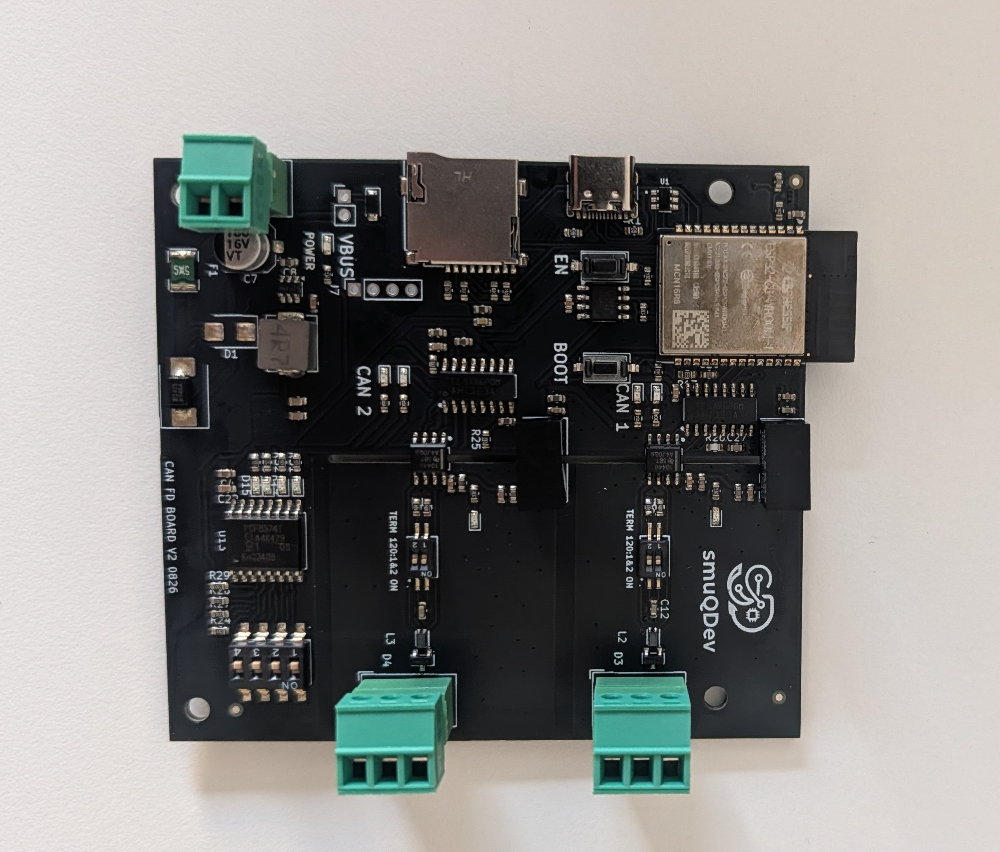
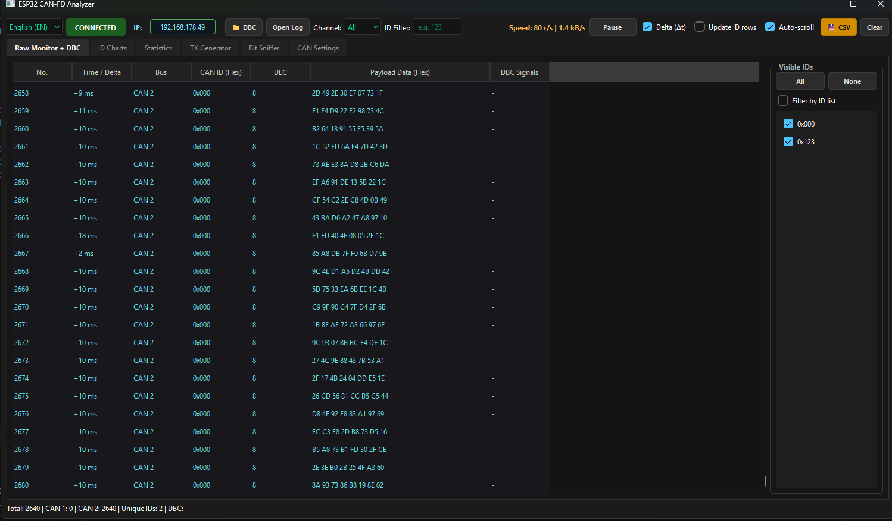

# ESP32-C5 Dual Isolated CAN FD Gateway

## Hardware Availability

The first batch of the ESP32-C5 Dual Isolated CAN-FD board is available for purchase at the following stores:
*   [Get it on Lectronz](https://lectronz.com/products/esp32-c5-dual-isolated-can-fd-board-first-batch)
*   [Get it on Tindie](https://www.tindie.com/products/smuqdev/esp32-c5-dual-isolated-can-fd-board-first-batch/)

An ESP-IDF application for the ESP32-C5 that acts as a versatile dual-channel CAN FD tool. It utilizes two on-chip TWAI-FD controllers and features **three dynamic, hardware-selectable operating modes**: a standalone CAN 1 ↔ CAN 2 bridge, an offline SD card logger, or a Wi-Fi TCP server for real-time PC analysis.

The firmware also provides an I2C OLED status panel, DS3231MZ RTC timekeeping, PCF8574-based DIP switch mode selection with LED indicators, and hardware-safe SD card unmounting. The host-side utilities include a high-performance GUI converter (`can_converter.py`) that exports raw logs directly to Vector ASC format for **SavvyCAN**.

## Features

*   **Three Dynamic Operating Modes** selected at boot via hardware DIP switches:
    *   **Mode 0: Hardware Bridge** - Directly routes traffic between CAN 1 and CAN 2.
    *   **Mode 1: SD Logger** - Captures CAN traffic directly to the SD card with RTC timestamps.
    *   **Mode 2: TCP Server** - Hosts a Wi-Fi socket server for real-time PC monitoring/injection.
*   **Two independent CAN FD channels** using the ESP32-C5 TWAI peripherals.
*   Up to **5 Mbit/s** data-phase bitrates with payloads up to 64 bytes.
*   **Hardware safe eject** button (GPIO28) to flush buffers and safely unmount the SD card without corruption.
*   **I2C status ecosystem**:
    *   OLED display for real-time stats, IP address, and safe-to-remove status.
    *   PCF8574 I/O expander for reading DIP switches and driving active-low status LEDs.
    *   DS3231MZ RTC for accurate log file timestamping.
*   Large PSRAM-backed receive ring buffers (3 MB each) to prevent frame drops under heavy load.
*   High-performance Python GUI utility (`can_converter.py`) using CustomTkinter to convert binary logs to `.asc` for SavvyCAN.



## Hardware Availability

The first batch of the ESP32-C5 Dual Isolated CAN-FD board is available for purchase at the following stores:
*   [Get it on Lectronz](https://lectronz.com/products/esp32-c5-dual-isolated-can-fd-board-first-batch)
*   [Get it on Tindie](https://www.tindie.com/products/smuqdev/esp32-c5-dual-isolated-can-fd-board-first-batch/)

## Hardware & Pinout

This table reflects the GPIO assignments compiled in `main/main.c`. GPIO numbers are ESP32-C5 chip GPIO numbers.

### Active Connections

| Function | ESP32-C5 GPIO | Direction | Connection |
| :--- | :---: | :--- | :--- |
| I2C SDA | GPIO0 | Bidirectional | OLED, DS3231MZ, PCF8574 SDA |
| I2C SCL | GPIO1 | Output | OLED, DS3231MZ, PCF8574 SCL |
| CAN Node 1 TX | GPIO4 | Output | Transceiver 1 TXD |
| CAN Node 1 RX | GPIO5 | Input | Transceiver 1 RXD |
| CAN Node 2 TX | GPIO23 | Output | Transceiver 2 TXD |
| CAN Node 2 RX | GPIO24 | Input | Transceiver 2 RXD |
| SD Eject Button| GPIO28 | Input | Active-Low push button (Internal Pull-up) |

### PCF8574 I/O Expander Mapping

The PCF8574 (`0x20`) is used to read hardware DIP switches and drive status LEDs. 
*Note: LEDs are wired Active-Low (connected to VCC).*

| PCF Pin | Function | Logic |
| :--- | :--- | :--- |
| **P0** | Mode Select: Bridge Only | Input (Pulled to GND when ON) |
| **P1** | Mode Select: SD Logger | Input (Pulled to GND when ON) |
| **P2** | Mode Select: TCP Server | Input (Pulled to GND when ON) |
| **P4** | Status LED: Bridge Mode | Output (Active-Low / `0` = ON) |
| **P5** | Status LED: SD Logger | Output (Active-Low / `0` = ON) |
| **P6** | Status LED: TCP Server | Output (Active-Low / `0` = ON) |

### SD-Card SPI Mapping

| SD-card SPI signal | ESP32-C5 GPIO |
| :--- | :---: |
| MOSI | GPIO8 |
| MISO | GPIO9 |
| SCLK | GPIO10 |
| CS | GPIO6 |

## CAN Configuration

Both channels use CAN FD frames with bit-rate switching (BRS) enabled.

| Channel | Arbitration | Data Phase |
| :--- | :---: | :---: |
| **CAN 1** | 1 Mbit/s | 5 Mbit/s |
| **CAN 2** | 1 Mbit/s | 2 Mbit/s |

## Operating Modes

At boot, the ESP32-C5 reads the PCF8574 P0-P2 pins. Only **one** mode is activated. 

1.  **Bridge Mode (P0 ON):**
    Passes CAN frames bidirectionally between CAN 1 and CAN 2. The OLED displays bridging statistics. The network and SD card are disabled to maximize routing speed.
    Optionally, a remote PC can enable **Bridge Frame Replace** (demo feature, disabled by default): frames routed from CAN 1 to CAN 2 can be fully substituted with a custom ID/DLC/data, either for every frame or only for frames matching a chosen original ID. Configured live over the TCP control port (see below).
2.  **SD Logger Mode (P1 ON):**
    Logs all CAN traffic from both nodes to a raw `.bin` file on the SD card. The filename is generated using the DS3231MZ RTC (e.g., `log_20260829_174959.bin`).
    **Safe Eject:** Pressing the button on GPIO28 flushes the remaining buffer, cleanly unmounts the FAT filesystem, and shows "Safe to remove!" on the OLED.
3.  **TCP Server Mode (P2 ON):**
    Connects to Wi-Fi and starts a TCP server. A host PC can connect to it to receive live frames and inject commands back onto the bus.

## Socket Interface (TCP Server Mode)

When in TCP Server Mode, the ESP32 acts as a host and listens for incoming connections from a PC/Client.

| Setting | Value | Meaning |
| :--- | :--- | :--- |
| Bind Address | `0.0.0.0` (Any) | ESP32 listens on its DHCP-assigned IP |
| TX Port | `3333` | ESP32 streams CAN logs to PC |
| RX Port | `3334` | PC sends commands to ESP32 |

The socket payload is a 74-byte packed binary structure formatted as follows (`<I B I B 64s` in Python struct):

| Field | Size | Description |
| :--- | :---: | :--- |
| `timestamp` | 4 bytes | Milliseconds from ESP timer startup |
| `node_id` | 1 byte | `1` (CAN 1) or `2` (CAN 2) |
| `id` | 4 bytes | CAN identifier; bit 31 marks an extended identifier |
| `dlc` | 1 byte | CAN FD DLC code (0-15) |
| `data` | 64 bytes | CAN payload storage; unused bytes are unspecified |

### Remote Control Commands (RX Port, TCP Packet Header `<B H` = type + payload size)

| `type` | Name | Payload struct | Purpose |
| :---: | :--- | :--- | :--- |
| `1` | `CAN_FRAME` | `<I B I B 64s` (`udp_cmd_frame_t`) | Inject a frame for immediate TX on a chosen node |
| `2` | `CAN_CONTROL` | `<I B I I B` (`can_control_command_t`) | Reconfigure a node's arbitration/data bitrate and listen-only mode |
| `4` | `MODE_CONTROL` | `<B` | Remotely switch operating mode (Bridge/SD Logger/TCP Server) |
| `5` | `BRIDGE_ID_MANIP` | `<I B B I I B 64s` (`bridge_frame_replace_command_t`) | Enable/configure the Bridge Frame Replace demo feature |

`bridge_frame_replace_command_t` fields: `magic`, `enabled`, `filter_enabled`, `filter_id` (original ID to match, only used when `filter_enabled`), `new_id` (bit 31 = extended), `new_dlc`, `new_data[64]`. Every control command replies with a single ack byte (`0` = accepted, `1` = rejected).

## Host-Side Utilities

*   **`can_converter.py`**: A high-performance Python desktop application with a CustomTkinter GUI. It converts large raw `.bin` SD card logs into standard Vector ASCII (`.asc`) format. This format can be imported natively into **SavvyCAN** for reverse engineering and analysis. *Requires: `pip install python-can customtkinter`*.
*   **`can_analyser_refactored/`**: A PyQt6 GUI application (`python can_analyser_refactored/main.py`) that connects to the ESP32 over TCP Wi-Fi for real-time monitoring, frame injection, remote CAN bitrate/mode control, and the Bridge Frame Replace demo (CAN Settings tab).

## Building and Flashing

### 1. Prerequisites & Partition Table
- ESP-IDF **6.0.2** (or a compatible 6.x release).
- PSRAM must be enabled in `menuconfig`.
- Due to the application's complexity, the default 1 MB application partition is too small. You must use a custom partition table.

Create a `partitions.csv` file in your project root:
```csv
# Name,   Type, SubType, Offset,  Size, Flags
nvs,      data, nvs,     ,        0x6000,
phy_init, data, phy,     ,        0x1000,
factory,  app,  factory, ,        3M,
```

### 2. Configure Wi-Fi

Create `main/secrets.h` with your Wi-Fi credentials:
```c
#pragma once

#define WIFI_SSID "your-network-name"
#define WIFI_PASS "your-network-password"
```

### 3. Project layout
```
main/                      Application entry point and core task routing
components/twai_manager/   Reusable TWAI/TWAI-FD node manager and recovery
components/can_services/   CAN node ownership, RX handling, bridge routing, and frame replace demo
components/tcp_service/    TCP monitor stream and remote control command parsing
components/c_oled/         SSD1306-style I2C OLED helper
components/ds3231mz/       DS3231MZ RTC driver
components/pcf8574/        PCF8574 I/O-expander driver (DIP + LEDs)
components/sdcard_service/ SD-card service and FAT mounting
can_converter.py           High-performance CustomTkinter GUI for SavvyCAN (.asc) conversion
can_analyser_refactored/   PyQt6 host-side GUI: monitoring, TX generator, remote control, bridge frame replace
partitions.csv             Custom partition layout for 3MB app size
```

##Python analyser


## Disclaimer
This software is provided "as is", without warranty of any kind, express or implied. Use it at your own risk. The author takes no responsibility for any damage, data loss, hardware failure, or other issues that may result from using this project.
